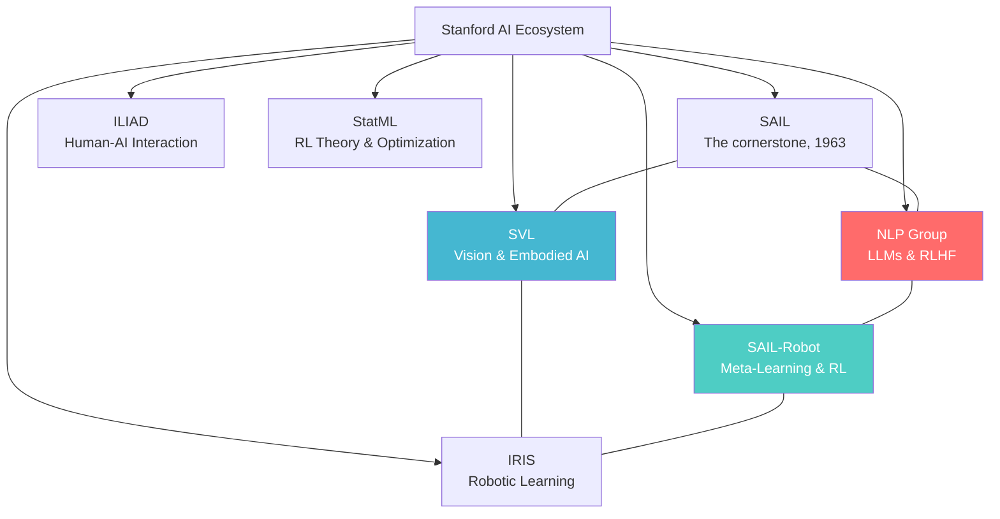
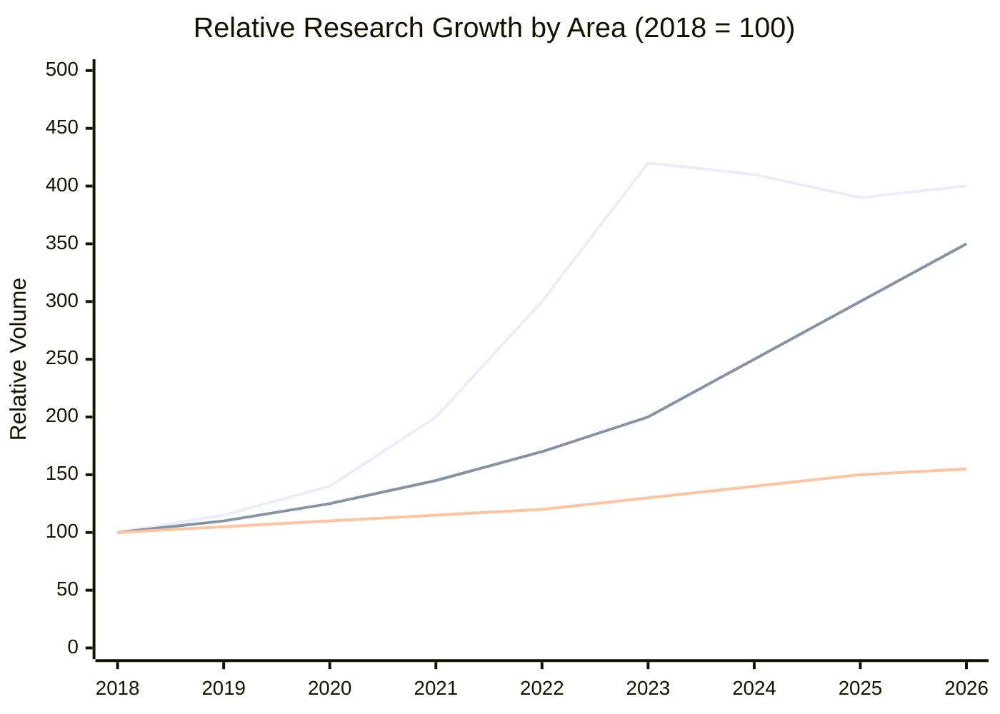
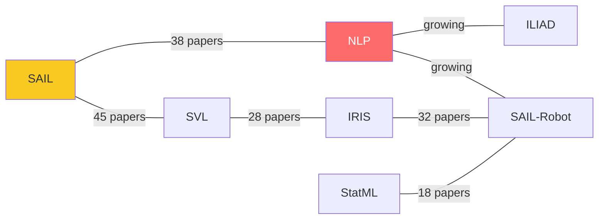
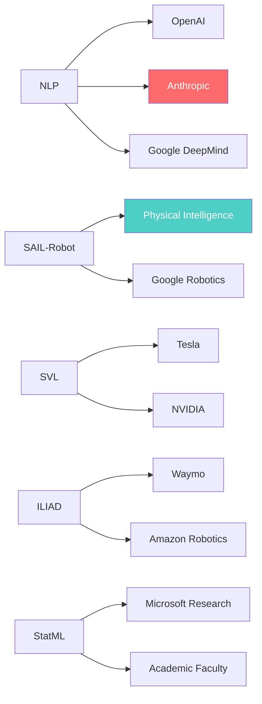

<div align="center">

# Stanford AI Labs Ecosystem

**A data-driven map of Stanford's AI research landscape — built by someone who wanted to understand the ecosystem before walking into it.**

[](https://www.python.org/)
[](LICENSE)
[]()
[]()


*This is the vibe. Nine interactive visualizations, structured data, and a lot of time on lab websites.*

*Author: HongJin HE (何泓锦) · HKUST AI · Stanford Exchange Student, Summer 2026*
*Course Foundation: Data Visualization, Tallinn University (Winter 2026)*

</div>

---

## Why This Exists

Most students research grad schools by clicking through lab websites for an hour and then deciding based on vibes. I wanted a more systematic picture of Stanford's AI ecosystem before my exchange started — so I applied data visualization methods to map it properly.

This is the result: 7 labs, 8 research areas, a 2018–2026 timeline, and more time spent on Google Scholar than I'd like to admit.

---

## The Landscape



*Red: Fastest growing (LLM/RLHF boom). Teal: Global #1 in meta-learning. Blue: Embodied AI leader.*

---

## Lab Profiles (mid-2026)

| Lab | Core Strength | 2026 Claim to Fame |
|-----|-------------|-------------------|
| **NLP Group** | LLMs, RLHF, AI Safety | Direct lineage to ChatGPT's RLHF; Stanford → Anthropic pipeline |
| **SAIL-Robot** | Meta-Learning, Robotic RL | MAML; Chelsea Finn's lab is globally #1 in meta-learning |
| **SVL** | Embodied AI, 3D Vision | Gibson, Habitat simulation environments |
| **StatML** | RL Theory, Offline RL | Emma Brunskill's education AI; Offline RL theory |
| **ILIAD** | Human-AI Interaction | Dorsa Sadigh's active learning for HRI |
| **IRIS** | Robotic Learning | Manipulation, deformable objects |
| **SAIL** | Broad AI | Hub for everything; largest team |

---

## Research Trends (2018–2026)



*Top line: LLMs/RLHF/Alignment. Middle: Embodied AI & Robotics. Bottom: Classical CV (plateauing).*

**What's growing fast in 2025–2026:**
- **RLHF / Alignment** — Stanford NLP Group alumni are central to this globally
- **AI Agents & Tool Use** — Direct connection to GPT-4o / Claude agentic capabilities
- **Multimodal Foundation Models** — SVL + NLP collaboration increasing rapidly
- **AI Safety** — Partly driven by the Stanford → Anthropic talent pipeline

**What's plateauing:**
- Traditional supervised NLP (absorbed into LLM paradigm)
- Classical computer vision (non-neural methods)

---

## Collaboration Network



---

## Industry Talent Flows



The Stanford → Anthropic pipeline is particularly strong — Constitutional AI and RLHF techniques trace directly to NLP Group alumni. This is now a documented institutional pattern.

---

## Visualizations (9 total)

The full Colab notebook generates:

1. **Radar chart** — multi-dimensional strength comparison across 8 research areas
2. **Stacked area timeline** — annual publication output 2018–2026
3. **Force-directed network** — inter-lab collaboration graph
4. **Impact heatmap** — domain scores across all labs
5. **3D bubble chart** — team size × h-index × paper output
6. **Sunburst diagram** — hierarchical lab → area → project structure
7. **Word cloud** — 2020–2026 paper title keywords
8. **Comprehensive dashboard** — multi-metric comparison panel

---

## Running It

```bash
git clone https://github.com/hongjin-he/stanford-ai-labs-ecosystem.git
cd stanford-ai-labs-ecosystem
pip install -r requirements.txt
jupyter notebook
```

Or click **Open in Colab** at the top for zero-setup execution.

---

## What I Actually Learned From This

Building this visualization before arriving at Stanford changed how I walked into the ecosystem. I knew which labs to visit, which professors' work overlapped with mine, and where the interesting cross-lab friction points were.

Data visualization isn't just a presentation skill. It's a research planning skill.

---

## Citation

```bibtex
@misc{he2026stanford,
  author       = {He, Hongjin},
  title        = {Stanford AI Labs Ecosystem: A Comprehensive Data Visualization Analysis},
  year         = {2026},
  howpublished = {\url{https://github.com/hongjin-he/stanford-ai-labs-ecosystem}}
}
```

---

<div align="center">

**Contact**: hehongjinhkust0911@gmail.com · [GitHub](https://github.com/hongjin-he) · [GFlowNet-Alpha-Mining](https://github.com/hongjin-he/GFlowNet-Alpha-Mining) · [World Models Paper](https://github.com/hongjin-he/mathmatical-framework-for-world-models-in-quant-finance)

<sub>MIT License · HKUST × Stanford · 2026</sub>

</div>
