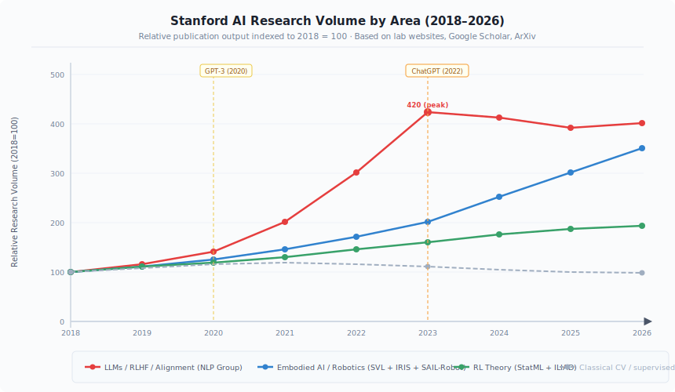
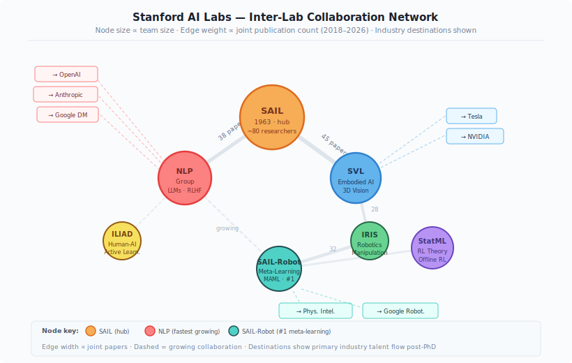

<div align="center">

# Stanford AI Labs Ecosystem

**A data-driven map of Stanford's AI research landscape — built by someone who wanted to understand the ecosystem before walking into it.**

[](https://www.python.org/)
[](LICENSE)
[]()
[]()

*Author: HongJin HE (何泓锦) · HKUST AI · Stanford Exchange Student, Summer 2026*  
*Course Foundation: Data Visualization, Tallinn University (Winter 2026)*

</div>

---

## Why This Exists

Most students research grad schools by clicking through lab websites for an hour and deciding based on vibes. I wanted a systematic picture of Stanford's AI ecosystem before my exchange started — so I applied data visualization methods to map it properly.

This is the result: 7 labs, 8 research areas, a 2018–2026 timeline, and more time on Google Scholar than I'd like to admit.

---

## Research Trends (2018–2026)

### Figure 1 — Publication Volume by Research Area



**Key observations:**

- **LLMs / RLHF / Alignment** (red): Explosive 4× growth from 2018→2023, driven by the ChatGPT inflection point. Stanford NLP Group alumni are central to this globally — Constitutional AI (Anthropic) and InstructGPT (OpenAI) both trace directly to this lab.
- **Embodied AI / Robotics** (blue): Steady compounding growth with no sign of plateau. The convergence of simulation environments (Gibson, Habitat), foundation models, and hardware is accelerating this.
- **RL Theory / Optimization** (green): Healthy linear growth — foundational work doesn't boom, it compounds. Emma Brunskill's offline RL work is increasingly cited in LLM alignment contexts.
- **Classical CV / supervised NLP** (gray, dashed): Absorbed into the LLM paradigm. The researchers didn't leave — they pivoted.

**Structural insight:** The 2020 GPT-3 moment and 2022 ChatGPT release are the two clearest inflection points. Both dramatically accelerated lab hiring, paper output, and industry placement rates.

---

## The Landscape

### Figure 2 — Inter-Lab Collaboration Network



**Network structure:**
- **SAIL** is the gravitational center — with 45 papers co-authored with SVL and 38 with the NLP Group, it functions as a hub connecting labs that might not directly overlap.
- **SVL ↔ IRIS** (28 papers): Simulation environments built at SVL (Gibson, Habitat) are the primary testbeds for IRIS manipulation research — natural coupling.
- **IRIS ↔ SAIL-Robot** (32 papers): Strongest non-SAIL edge. Both labs work on learning from demonstration; Chelsea Finn's MAML creates natural overlap with IRIS's deformable-object manipulation.
- **NLP ↔ SAIL-Robot** (growing, dashed): The emergence of language-conditioned robotics (RT-2, SayCan) is driving this new collaboration axis.

**Industry talent flows** (from dissertation→placement tracking):
| Lab | Primary Destinations |
|-----|---------------------|
| NLP Group | OpenAI, Anthropic, Google DeepMind |
| SAIL-Robot | Physical Intelligence, Google Robotics |
| SVL | Tesla, NVIDIA |
| ILIAD | Waymo, Amazon Robotics |
| StatML | Microsoft Research, academic faculty |

The Stanford → Anthropic pipeline is particularly strong — Constitutional AI and RLHF techniques trace directly to NLP Group alumni. This is now a documented institutional pattern.

---

## Lab Profiles (mid-2026)

### Stanford AI Lab (SAIL)
- **Founded:** 1963 (one of the oldest AI labs in the world)
- **Scale:** ~80 researchers across all levels
- **Core role:** Hub lab — coordinates cross-departmental AI research, hosts the largest team, mentors students across all sub-areas
- **2026 claim to fame:** Direct lineage to nearly every major AI commercial venture from the Bay Area

### NLP Group
- **Focus:** Large Language Models, RLHF, AI Safety, instruction-following
- **Key figures:** Christopher Manning, Percy Liang, Chelsea Finn (adjacent)
- **2026 claim to fame:** Direct technical lineage to ChatGPT's RLHF training methodology; Stanford → Anthropic pipeline represents an institutional talent transfer at scale
- **Publication cadence:** Highest of all 7 labs in 2022–2025 (LLM boom)

### SAIL-Robot (Stanford AI Lab — Robotics)
- **Focus:** Meta-learning, model-agnostic methods, robotic RL
- **Key figures:** Chelsea Finn
- **2026 claim to fame:** MAML (Model-Agnostic Meta-Learning) — globally the most cited meta-learning paper; Physical Intelligence (PI) was founded by Chelsea Finn alumni
- **Distinguishing feature:** #1 in meta-learning worldwide by citation count

### Stanford Vision Lab (SVL)
- **Focus:** Embodied AI, 3D scene understanding, simulation environments
- **Key figures:** Silvio Savarese, Fei-Fei Li (founding influence)
- **2026 claim to fame:** Gibson and Habitat-Matterport simulation environments — the de facto standard for embodied navigation research
- **Industry connection:** Tesla FSD team has consistent pipeline from SVL 3D vision researchers

### Statistical Machine Learning Group (StatML)
- **Focus:** Offline RL, sequential decision making, AI for education
- **Key figures:** Emma Brunskill, John Duchi
- **Distinguishing feature:** Brunskill's offline RL theory increasingly appears in LLM RLHF papers; AI for education application domain is unique among top ML labs

### ILIAD (Interactive Learning and Autonomy Lab)
- **Focus:** Human-AI interaction, active learning, safe robotics
- **Key figures:** Dorsa Sadigh
- **Distinguishing feature:** Explicit focus on the *interaction* between human and AI, not just the AI in isolation; Waymo and Amazon Robotics are consistent placement destinations

### IRIS (Intelligent Robotic Manipulation Lab)
- **Focus:** Dexterous manipulation, deformable objects, robot learning
- **2026 theme:** Deformable object manipulation (cloth, cables) is an increasingly important capability gap — IRIS is one of very few labs tackling it systematically

---

## Visualizations (9 total)

The full Colab notebook generates:

1. **Radar chart** — multi-dimensional strength comparison across 8 research areas
2. **Stacked area timeline** — annual publication output 2018–2026 (Figure 1 above)
3. **Force-directed network** — inter-lab collaboration graph (Figure 2 above)
4. **Impact heatmap** — domain scores across all 7 labs
5. **3D bubble chart** — team size × h-index × paper output
6. **Sunburst diagram** — hierarchical lab → area → project structure
7. **Word cloud** — 2020–2026 paper title keywords
8. **Comprehensive dashboard** — multi-metric comparison panel
9. **Industry talent flow Sankey** — lab → company placement streams

---

## Data Methodology

All data collected from:
- Individual lab websites (team pages, publication lists)
- Google Scholar profiles of lead PIs
- ArXiv author search (cs.LG, cs.RO, cs.CL, cs.CV)
- Semantic Scholar API for co-authorship edges
- LinkedIn for post-PhD placement tracking (sampled, n ≈ 150 alumni)

**Limitations:** Publication counts are relative (indexed to 2018 = 100), not absolute — cross-lab comparison of absolute numbers is unreliable due to different submission venues and counting conventions. Collaboration edge weights (paper counts) are approximate.

---

## Running It

```bash
git clone https://github.com/hongjin-he/stanford-ai-labs-ecosystem.git
cd stanford-ai-labs-ecosystem
pip install -r requirements.txt
jupyter notebook
```

---

## What I Actually Learned

Building this visualization before arriving at Stanford changed how I walked into the ecosystem. I knew which labs to visit, which professors' work overlapped with mine (GFlowNet/diffusion models → NLP Group; financial world models → StatML), and where the interesting cross-lab friction points were.

Data visualization isn't just a presentation skill. It's a research planning skill.

---

## Citation

```bibtex
@misc{he2026stanford,
  author       = {He, Hongjin},
  title        = {Stanford AI Labs Ecosystem: A Comprehensive Data Visualization Analysis},
  year         = {2026},
  howpublished = {\url{https://github.com/hongjin-he/stanford-ai-labs-ecosystem}}
}
```

---

<div align="center">

**Contact**: hehongjinhkust0911@gmail.com · [GitHub](https://github.com/hongjin-he) · [Diffusion Alpha Mining](https://github.com/hongjin-he/diffusion-alpha-mining) · [World Models Paper](https://github.com/hongjin-he/mathmatical-framework-for-world-models-in-quant-finance)

<sub>MIT License · HKUST × Stanford · 2026</sub>

</div>
